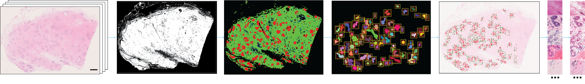

# **Normal breast tissue classifiers assess large-scale tissue compartments with high accuracy**

[Paper]() | [Cite]()

**Abstract:** Cancer research emphasises early detection, yet quantitative methods for normal tissue analysis remain limited. Digitised haematoxylin and eosin (H&E)-stained slides enable computational histopathology, but artificial intelligence (AI)-based analysis of normal breast tissue (NBT) in whole slide images (WSIs) remains scarce. We curated 70 WSIs of NBTs from multiple sources and cohorts with pathologist-guided manual annotations of epithelium, stroma, and adipocytes (https://github.com/cancerbioinformatics/OASIS). Using this dataset, we developed robust convolutional neural network (CNN)-based, patch-level classification models, named NBT-Classifiers, to tessellate and classify NBTs at different scales. Across three external cohorts, NBT-Classifiers trained on 128 x 128 µm and 256 x 256 µm patches achieved AUCs of 0.98–1.00. Two explainable AI-visualisation techniques confirmed the biological relevance of tissue class predictions. Moreover, NBT-Classifiers can be integrated into an end-to-end pre-processing framework to support efficient downstream image analysis in lobular regions. Their high compatibility with QuPath further enables broader application in studies of normal tissues, in the context of breast.


<p align="center">
    
</p>


## Installation
To get started, install [HistoQC](https://github.com/choosehappy/HistoQC.git) and NBT-Classifier:
```
git clone https://github.com/choosehappy/HistoQC.git
git clone https://github.com/SiyuanChen726/NBT-Classifier.git
cd NBT-Classifier
conda env create -f environment.yml
conda activate nbtclassifier
```
For detailed implementation, please refer to the Docker section below.


## Docker
NBT-Classifier supports Docker for reproducible analysis of user histology data, with tutorial examples for both command-line and Jupyter notebook. 

To get the Docker image:
```
docker pull siyuan726/nbtclassifier:latest
```
or use singularity for HPC:
```
singularity pull docker://siyuan726/nbtclassifier:latest
```


## Implementation using host data 
Host data is expected to be organised as follows:
```
project/
├── WSIs/host slides, such as slide1.ndpi, slide2.ndpi, slide3.svs, ...
├── QCs/
└── FEATUREs/
```

The nbtclassifier Docker image has an exposed volume (/app) that can be mapped to the host folder (such as project/). The following code launches Singularity container on a HPC GPU computation node with:
- NVIDIA GPU support (--nv)
- Host WSI directory mounted to /app/WSIs (--bind)
- Temporary writable filesystem (--writable-tmpfs)
  
```
singularity shell --nv \ 
--bind /the/host/folder/project:/app/project \
--writable-tmpfs \
./nbtclassifier_latest.sif
```

Within the nbtclassifier docker container, you will see an app folder under "root":
```
/app/
├── NBT-Classifier/
├── HistoQC/
├── examples/
├── Dockerfile
└── project/
    ├── WSIs/host slides, such as slide1.ndpi, slide2.ndpi, slide3.svs, ...
    ├── QCs/
    └── FEATUREs/
```


Within the nbtclassifier docker container on HPC, manually activate conda environment via:
```
source /opt/conda/etc/profile.d/conda.sh
conda activate nbtclassifier
```

Implement HistoQC to obtain masks of foreground tissue regions:
```
cd /app/HistoQC
python -m histoqc -c NBT -n 3 '/app/project/WSIs/*.ndpi' -o '/app/project/QCs'
```
Note, change `.ndpi` into the exact format of the host WSI files


This step yields:
```
/app/
├── NBT-Classifier/
├── HistoQC/
├── examples/
├── Dockerfile
└── project/
    ├── WSIs/
    ├── QCs/
    │   |── slide1/slide1_maskuse.png, ... 
    │   |── slide2/slide2_maskuse.png, ...
    │   |── slide3/slide3_maskuse.png, ...
    │   └── ... 
    └── FEATUREs/     
```


Then, use the following script to tessellate and classify NBT tissue components on WSIs:
```
cd /app/NBT-Classifier
python main.py \
--wsi_folder /app/project/WSIs \
--mask_folder /app/project/QCs \
--output_folder /app/project/FEATUREs \
--model_type TC_512 \
--patch_size_microns 128 \
--use_multithreading \
--max_workers 8
```

This step yields:
```
/app/
├── NBT-Classifier/
├── HistoQC/
├── examples/
├── Dockerfile
└── project/
    ├── WSIs/
    ├── QCs/
    └── FEATUREs/
        |── slide1/
        |   ├──slide1_TC_512_pattern_x_idx.npy     
        |   ├──slide1_TC_512_pattern_y_idx.npy     
        |   ├──slide1_TC_512_pattern_im_shape.npy  
        |   ├──slide1_TC_512_pattern_patches.npy    
        |   ├──slide1_TC_512_probmask.npy                     # This contains the tissue classification results
        |   ├──slide1_TC_512.png                              # This visualises the tissue classification map
        |   ├──slide1_TC_512_patch_all.csv                    # This saves all classified patches
        |   ├──slide1_TC_512_cls_wsi.json                     # This imports all classified patches into QuPath via the annotation_loader.groovy script
        |   ├──slide1_TC_512_epi_(18,0,0,8704,6208)-mask.png  # This imports detected lobuels into QuPath via the mask2annotation.groovy script
        |   ├──slide1_TC_512_patch_roi.csv                    # This saves the selected patches from ROIs containing lobules and peri-lobular stroma
        |   ├──slide1_TC_512_cls_roi.json                     # This imports selected patches into QuPath using the annotation_loader.groovy script
        |   └──slide1_TC_512_bbx.png                          # This visualises the selected ROIs
        └── ...
```

Alternatively, tessellate and classify NBTs using larger patches of 1024x1024 pixels:
```
cd /app//NBT-Classifier
python main.py \
--wsi_folder /app/project/WSIs \
--mask_folder /app/project/QCs \
--output_folder /app/project/FEATUREs \
--model_type TC_1024 \
--patch_size_microns 256 \
--use_multithreading \
--max_workers 8
```


## Implementation using example data 
In the local terminal, prepare the following folders:
```
mkdir -p /path/to/your/project/QCs /path/to/your/project/FEATUREs
```

then run the following to launch the nbtclassifier docker container:
```
singularity shell --nv \ 
--bind /path/to/your/project:/app/project \
--writable-tmpfs 
./nbtclassifier_latest.sif
```

Within the container, run the following:
```
source /opt/conda/etc/profile.d/conda.sh
conda activate nbtclassifier

# obtain foreground tissue mask
cd /app/HistoQC
python -m histoqc -c NBT -n 4 '/app/examples/QuPath/*.ndpi' -o '/app/project/QCs'

# tessellate and classify WSIs of NBTs using 512x512-pixel patches
cd /app//NBT-Classifier
python main.py \
--wsi_folder /app/examples/QuPath \
--mask_folder /app/project/QCs \
--output_folder /app/project/FEATUREs \
--model_type TC_512 \
--patch_size_microns 128 \
--use_multithreading \
--max_workers 8

# or tessellate and classify WSIs of NBTs using 1024x1024-pixel patches
python main.py \
--wsi_folder /app/examples/QuPath \
--mask_folder /app/project/QCs \
--output_folder /app/project/FEATUREs \
--model_type TC_1024 \
--patch_size_microns 256 \
--use_multithreading \
--max_workers 8
```


## Jupyter notebooks
The [notebooks](notebooks) demonstrating [NBT-Classifier framework](/notebooks/NBT_pipeline.ipynb), [manual annotation](/notebooks/vis_annotation.ipynb), [model interpretability](/notebooks/vis_CAMs.ipynb), and [feature visualisation](/notebooks/vis_features.ipynb) can be reproduced in the nbtclassifier Docker Image. 

For this, within the nbtclassifier docker container, run the following:
```
cd /app//NBT-Classifier

# register the conda environment as a Jupyter kernel
python -m ipykernel install \
    --user \
    --name=nbtclassifier \
    --display-name="NBTClassifier"

chmod +x run_jupyter.sh
./run_jupyter.sh
```
Please then check the notebooks in `/app/NBT-Classifier/notebooks`


## QuPath
The nbtclassifier Docker Image also provides examples for the use of QuPath. 
Within the nbtclassifier docker container, please copy the `/app/examples/QuPath` folder to the binded host folder (such as /app/project) using `cp -r /app/examples/QuPath /app/project/`

Within QuPath, open the example WSI (you might need to relocate the file in your host folder)
Go to `Automate` -> `Project scripts...` -> `mask2annotation` to load the binary lobule mask (17064108_FPE_1_TC_512_epi_(18,0,0,8704,6208)-mask.png)
Go to `Automate` -> `Project scripts...` -> `annotation loader` to load the .json files (please make sure the Fill mode is enabled for detection)
Moreover, import the `/app/examples/QuPath/annotations/17064108_FPE_1.geojson` into QuPath to see the manual annotation for the example slide.


